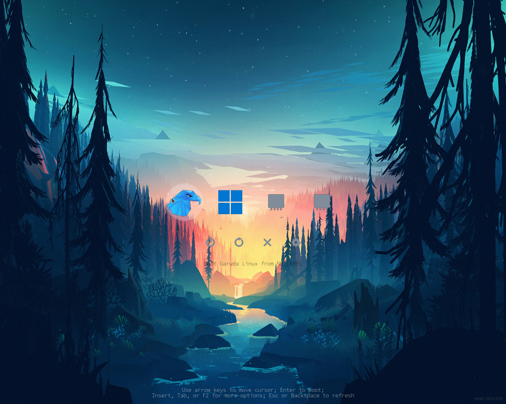
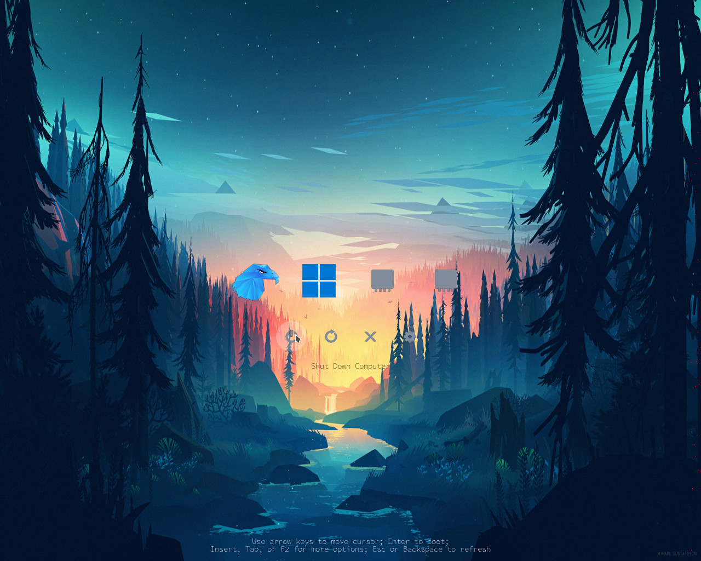
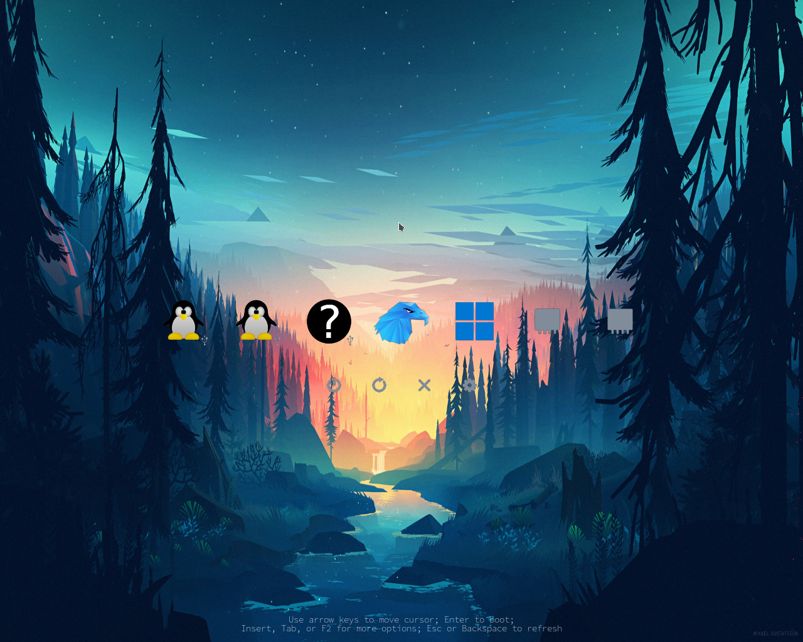
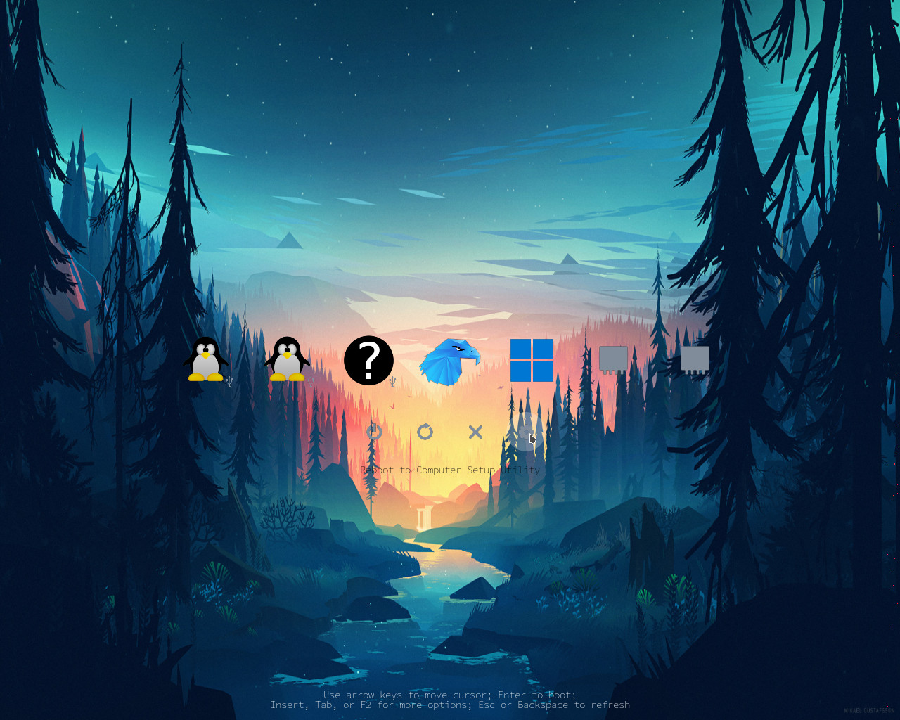
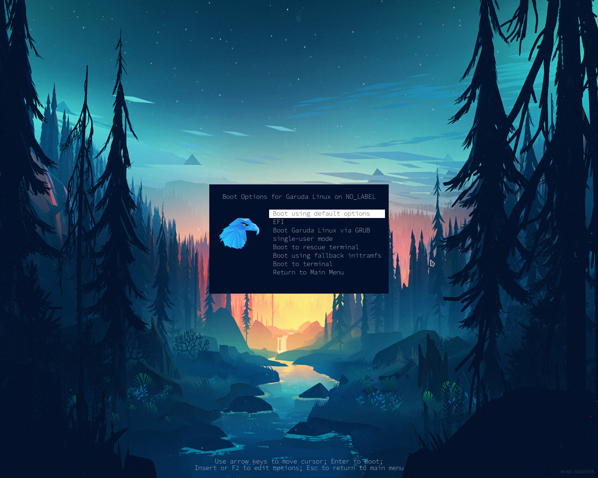

# rEFInd theme

Copyright (c) AliciaT - AliciaTransmuted, Alberto Bursi - bobafetthotmail, Kaiz Khatri - ful1e5

* White OS icons and selection_big.png, selection_small.png from AliciaT - AliciaTransmuted https://github.com/AliciaTransmuted/rEFInd-chalkboard

* Color OS icons and selection-big.png, selection-small.png, selection_big.png, selection_small.png from AliciaT - AliciaTransmuted https://github.com/AliciaTransmuted/rEFInd-details

* Fonts, arrow_\*, bg\*, func_\*, part of os_\*, tool_\*, vol_\* from Alberto Bursi - bobafetthotmail https://github.com/bobafetthotmail/refind-theme-regular
* Cursor (left_ptr.svg) from Kaiz Khatri - ful1e5 https://github.com/ful1e5/BreezeX_Cursor

Copyright (c) Valeria Fadeeva - https://github.com/Valeria-Fadeeva/linux-boot-efi

* Cursor moved to (x,y) = (0,0) recolor to dark (bg: 4c4c4cff, contour: ffffffff) and light (bg: fcfcfcff, contour: 4c4c4cff) theme

**theme.conf**

```
icons_dir themes/lera-forest/color-icons

big_icon_size 96

small_icon_size 48

banner themes/lera-forest/background.png
banner_scale fillscreen

selection_big themes/lera-forest/color-icons/selection-big.png

selection_small themes/lera-forest/color-icons/selection-small.png

font themes/lera-forest/fonts/source-code-pro-extralight-14.png
```








